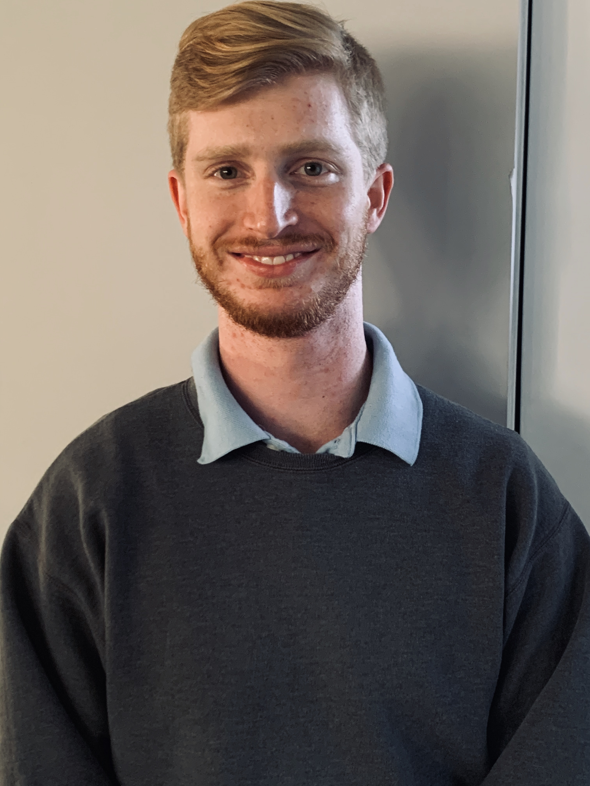

# About me:



## Programming Back Group


I started programming in 2014, my first language was
python, although I did not really start coding
until I was at **Miracosta College**. Java, was really the first
language I learned and gained knowledge in. However, I always loved the idea
that programmers have full control over the computer that they are programming.
So, I needed a language that was not Java. *C++* values the power the a computer
gives to each programmer and it does not worry to much about keeping you safe 
from the computer. This reminds me of my favorite quotes. 
> To err is human, but to really foul things up you need a computer. - Paul R. Ehrlich

And now for a random code snippet 
```javascript
    if (isAwesome){
        return false
    }
```
Now here is a list of the schools I went to

1. Carlsbad High School (2010-2014)
2. MiraCosta College (2014-2020)
3. Palomar College (2017-2020)
4. University of California San Diego (2020-Present) 

A list of languages I know

* C/C++
* Javascript
* Python
* C#
* Sagemath

Here is a link to the [README FILE](https://github.com/SoloChristo/cse110_lab1/blob/main/README.md)

[README FILE](README.md)

- [x] Headings
- [x] Styling text
- [x] Quoting text
- [x] Quoting code
- [ ] External Links
- [ ] Section links
- [x] Relative links (Link to another .md file or an image in your repo. If linking to an image, encode it as a regular link rather than an image.)
- [x] Ordered and Unordered Lists
- [x] Task lists


